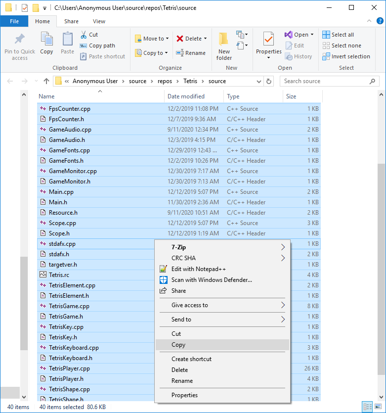

# Build and run Tetris
The project was created to evaluate Allegro and C++.
The result is a tetris like game that can be played by 2 players. 
I decided to share the code to help others.
This is a guide on how to copy and compile the source code.

We use Visual Studio 2019 to complie and run the program.
When we use the term Allegro we mean Allegro 5.

The code is hoby code, it is not profesional code, I wrote it in my spare time and I hope it might inspire a kid somewhere to become a programming wizard.

## Source 
You can pull the entire git project and use the existing project file to build the program "Tetris.sln" or you can create the project yourself using the essential [source](source) files.

Creating the project from scratch is descrbied below.

The essential files are the C++ files needed to create the project from scratch  (.cpp, .h, .rc). 
 
 - AllegroFont.cpp
 - AllegroFont.h
 - AllegroResources.cpp
 - AllegroResources.h
 - AllegroSound.cpp
 - AllegroSound.h
 - BasicResources.cpp
 - BasicResources.h
 - FpsCounter.cpp
 - FpsCounter.h
 - GameAudio.cpp
 - GameAudio.h
 - GameFonts.cpp
 - GameFonts.h
 - GameMonitor.cpp
 - GameMonitor.h
 - Main.cpp
 - Main.h
 - Resource.h
 - Scope.cpp
 - Scope.h
 - stdafx.cpp
 - stdafx.h
 - targetver.h
 - Tetris.rc
 - TetrisElement.cpp
 - TetrisElement.h
 - TetrisGame.cpp
 - TetrisGame.h
 - TetrisKey.cpp
 - TetrisKey.h
 - TetrisKeyboard.cpp
 - TetrisKeyboard.h
 - TetrisPlayer.cpp
 - TetrisPlayer.h
 - TetrisShape.cpp
 - TetrisShape.h
 - Util.cpp
 - Util.h
 
 Download only these files to avoid insecure binaries.

## Create the Projct
Start Visual Studio and create a new project.

Select C++ and select Windows Desktop Application.

Name the project.

Create the project. Click "Create".

Confirm any prompt that appears.  When done the new project should look as shown above.

## Add Allegro
Start the NuGet package manager.

Click Browse when NuGet has opened.

Type allegro in the search field then select "Allegro by Allegro Developers v5", mark the checkbox and click install.

Installing allegro may take some time. You might be asked to confirm the installation.

Wait until the installation process finishes as shown in the output window.

## Configure Allegro
View the properties of the project. Right click the project and select "Properties".

Select "All Configurations" in the top left corner and click "Allegro 5" then click "Add-ons". Then add the features of allegro that we intend to use.

Select "Release" in the top left corner and click "Allegro 5" then click "Library Type".  Let the release version be a single executable.

Optionally configure the Debug version by selecting "Debug" instead of "Release".

You might also want to disable the linker warning about missing .pdb files

## Copy the [source](source) code
You can use the command line to copy the source files to the project folder or the guide below.

Open File Explorer and navigate to the [source](source) folder and copy all the files in it.

Then close the File Explorer.

Right click the project and select 'Open Folder in File Explorer'.

It should look like this.

Then paste the source code files with Ctrl-V and overwrite existing files.

Confirm if Visual Studio asks you to overwrite or reload any files.

Then close the File Explorer.

## Configure the project to include the source files
Select 'Project -> Add Existing Item' and add the files we just pasted.

Here you can see the files to avoid.

    

Delete the file Tetris.cpp from the project by right clicking it.

The project should now compile.

## Run the game
Press F5 to build and run the game.

General key bindings.

            - M      Togle music.
            - F3     Togle grid.
            - F5     Start a new game.
            - F10    Togle the way the pieces move.
Player 1 key bindings.

            - A      Move Left.
            - S      Move Down.
            - D      Move Right.
            - W      Rotate.
Player 2 key bindings.

            - LEFT   Move Left.
            - DN     Move Down.
            - RIGHT  Move Right.
            - UP     Rotate.

## Game mechanics
We know the rules of tetris.
We must prevent the pit from becoming full as pieces drop into it.
We steer the falling pieces and try to make them fit to clear rows.
We get a bonus when we clear rows by dropping a piece.

If we clear more than one row by dropping a piece then:

 - the bonus gained is exponential to the amount of rows cleared.
 - the opponent gets rows inserted at the bottom of his pit.
 - some debris will drop on the opponent if we cleared 2 rows.
 - the opponents next piece becomes an L shape with 5 squres if we cleared 3 rows.
 
 

## Issues
The game needs better keyboard handling, ie keyboard strokes should be stored in a queue with all SHIFT info.

Rotation needs to be made less strict and refactored with they keyboard code.

The screen should shake proportionaly to the amount of rows popped.

Create a version that uses windows native sounds only.

Drop debris every X seconds ?

Let coliding debris merge with the player piece to create larger pieces.
